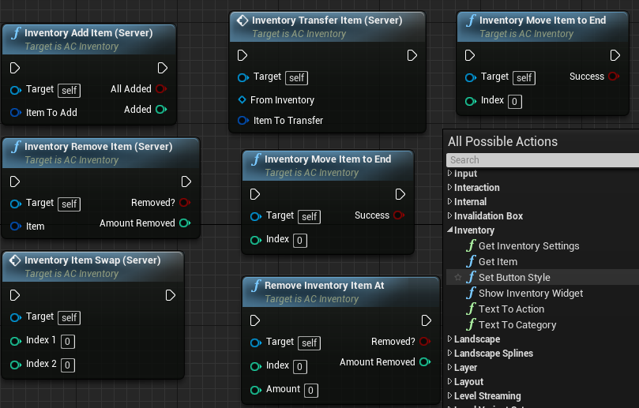

# Modular Inventory Component

This is a drag and drop inventory component for Unreal Engine 4. Currently implemented features are listed below.
- Modular system: Every element is controlled by data tables.
- Drag and drop items. Highly customisable. Comes with example items for testing.
- Made using Blueprints only! 
- Network Replication supported.

### Important Classes

 - __AC_Inventory:__ The main actor component. Attach it to the actor which will have the inventory. It could be a character with stash or an object which will act as a vault or loot bag.
 - __BPI_InventoryUser:__ Interface that you must add to user/character. Should be used to implement inventory actions.
 - __BPI_Item:__ Interface that you should add to an item blueprint. Should be used to implement inventory actions.
 - __DT_Inventories:__ Data table contains various visual inventory settings (e.g Background colour/title). If you want to have different visuals for different inventory. Use the same Row Name for the corresponding
 - __AC_Inventory:__ ('Inventory Name' variable).
 - __DT_Items:__ List of various items. Its upto you to use.
 - __E_ItemActions:__ List of possible item actions. You have to provide an array of this for each item
 - __E_ItemCategory:__ Categories of items. Used to filter in inventory panel.
 - __E_ItemProperty:__ Will be used later for item sorting implementation.
 - __FL_Inventory:__ A function library for commonly used items.
 - __ST_InventorySettings:__ A structure containing various settings for the inventory widget.
 - __ST_Item:__ Structure of items containing variables to store things like name, pic, item count for each item.
 - __W_ContextMenu:__ Context menu widget for an item.
 - __W_Inventory:__ The main inventory holder widget containing all the items. 
 - __W_Item:__ An item slot inside inventory. Responsible for drag and drop functions.
 - __W_Item:__ An item slot inside inventory. Responsible for drag and drop functions.
 - __W_RButton:__ A custom button widget used in dynamic category or dynamic context menus. 
 
 ### Some Useful Nodes

### Installation
1. Migrate
2. Add Inventory component
3. Use the blueprint functions to show inventory/add items/transfer/delete/modify

### Todos
 - Documentation
 - Creating an item list style instead of grid
 - Sorting items based on item property
 - Different sized Items

### Development
Want to contribute? Great send me a message.

### Special Thanks
This project includes some sample textures from 
[Kenney] and [Ravenmore]
### License
[CC 1.0] 

**Free Software, Hell Yeah!**

[//]: # (These are reference links used in the body of this note and get stripped out when the markdown processor does its job. There is no need to format nicely because it shouldn't be seen. Thanks SO - http://stackoverflow.com/questions/4823468/store-comments-in-markdown-syntax)

   [Kenney]: <http://kenney.nl/>
   [Ravenmore]: <http://dycha.net/>
   [CC 1.0]: <https://creativecommons.org/licenses/by/1.0>
